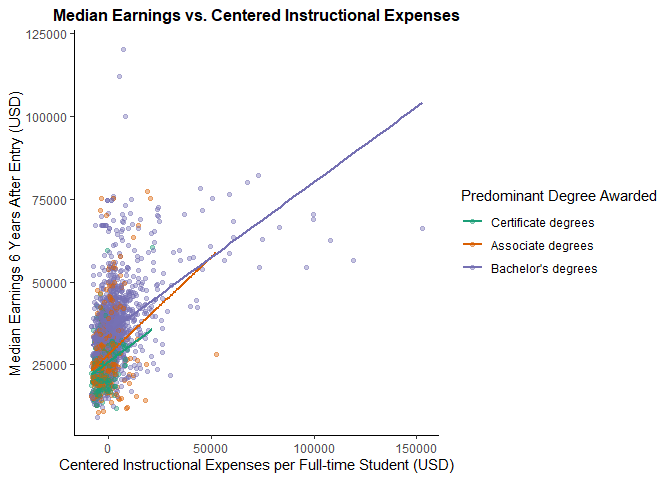
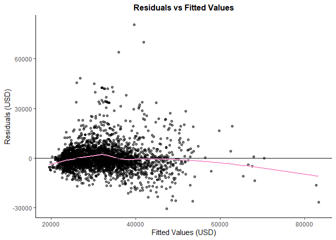
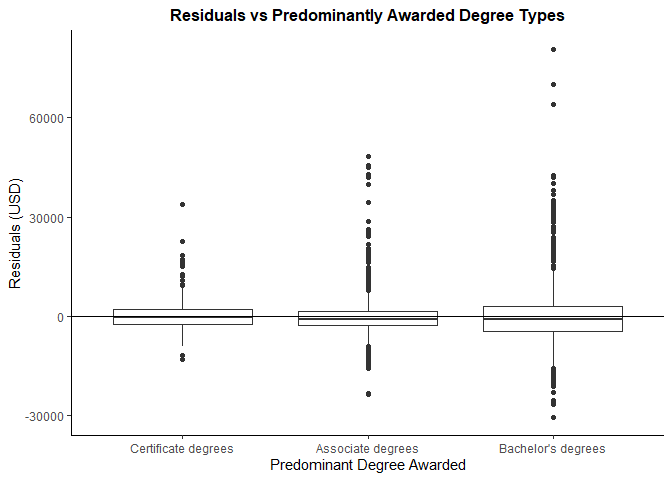
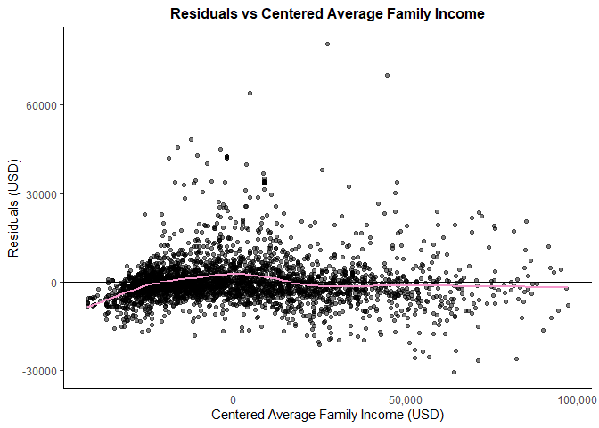
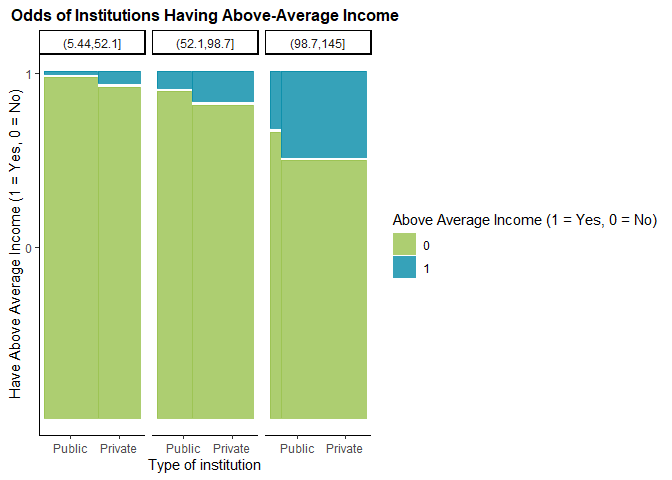

The Association Between Colleges’ Median Earnings with Instructional
Expenses and Control Type of Colleges
================
Avianna Bui

# Part 1. Load Packages & Data Set

## Load Packages

``` r
library(readr) 
library(dplyr) 
library(ggplot2) 
library(ggmosaic) 
library(broom) 
library(forcats) 
```

## Load Data

``` r
collegescorecard <- read_csv("Scorecard.csv") 
```

# Part 2. Cleaning & Data Context

# Data Cleaning

``` r
scorecard <- collegescorecard %>%
    filter(INEXPFTE > 0) %>% 
    filter(!is.na(MD_EARN_WNE_P6)) %>% 
    mutate(PREDDEG.Cat = case_when(
    PREDDEG==1 ~ "Certificate degrees", 
    PREDDEG==2 ~ "Associate degrees", 
    PREDDEG==3 ~ "Bachelor's degrees")) %>%  
    mutate(PREDDEG.Cat = fct_relevel(PREDDEG.Cat, "Certificate degrees")) %>% 
    mutate(centeredexp = (INEXPFTE) - mean(INEXPFTE)) %>% 
    mutate(centeredfaminc = (FAMINC) - mean(FAMINC)) %>%
    mutate(aboveaveincome = ifelse(MD_EARN_WNE_P6 > 49785, 1, 0)) %>% 
    mutate(Control.Cat = case_when(
    CONTROL == 1 ~ "Public", 
    CONTROL == 2 | CONTROL == 3 ~ "Private")) %>%  
    mutate(Control.Cat = fct_relevel(Control.Cat, "Public")) %>% 
    mutate(FAMINC1000 = FAMINC/1000) %>%
    mutate(FAMINC.Cat = cut(FAMINC1000, 3))
```

# Data Context

``` r
scorecard %>%
    summarize(min(INEXPFTE), max(INEXPFTE),
            min(MD_EARN_WNE_P6), max(MD_EARN_WNE_P6),
            min(FAMINC), max(FAMINC))
```

    ## # A tibble: 1 × 6
    ##   `min(INEXPFTE)` `max(INEXPFTE)` `min(MD_EARN_WNE_P6)` max(MD…¹ min(F…² max(F…³
    ##             <dbl>           <dbl>                 <dbl>    <dbl>   <dbl>   <dbl>
    ## 1             257          161644                  9200   120400   5583. 145228.
    ## # … with abbreviated variable names ¹​`max(MD_EARN_WNE_P6)`, ²​`min(FAMINC)`,
    ## #   ³​`max(FAMINC)`

# Part 3. Research Question 1

## Visualization

``` r
# Visualization: Median Earnings vs Centered Instructional Expenses
scorecard %>%
    ggplot(aes(x = centeredexp, y = MD_EARN_WNE_P6, color = PREDDEG.Cat)) +
    geom_point(alpha = 0.4) + 
    geom_smooth(method = 'lm', se = FALSE) + 
    labs(x = "Centered instructional expenses per full-time student (USD)", y = "Median earnings 6 years after entry (USD)", color = "Predominant degree awarded") + 
    theme_classic() + 
    scale_color_viridis_d() 
```

<!-- -->

``` r
#calculate correlation  instructional expenditures range
scorecard %>%
    group_by(PREDDEG.Cat) %>%
    summarize(cor(centeredexp,MD_EARN_WNE_P6)) 
```

    ## # A tibble: 3 × 2
    ##   PREDDEG.Cat         `cor(centeredexp, MD_EARN_WNE_P6)`
    ##   <fct>                                            <dbl>
    ## 1 Certificate degrees                              0.260
    ## 2 Associate degrees                                0.294
    ## 3 Bachelor's degrees                               0.448

``` r
#calculate instructional expenditures range
scorecard %>%
    group_by(PREDDEG.Cat) %>%
    summarize(min(INEXPFTE), max(INEXPFTE)) 
```

    ## # A tibble: 3 × 3
    ##   PREDDEG.Cat         `min(INEXPFTE)` `max(INEXPFTE)`
    ##   <fct>                         <dbl>           <dbl>
    ## 1 Certificate degrees             307           30243
    ## 2 Associate degrees               621           61172
    ## 3 Bachelor's degrees              257          161644

## Fitted Model

``` r
mod1 <- lm(MD_EARN_WNE_P6 ~ centeredexp + PREDDEG.Cat + centeredfaminc, data = scorecard) # fit a multiple linear regression model 

coef(mod1) %>% 
    format(scientific = FALSE) 
```

    ##                   (Intercept)                   centeredexp 
    ##               "29024.4851815"               "    0.3232484" 
    ##  PREDDEG.CatAssociate degrees PREDDEG.CatBachelor's degrees 
    ##               " 1046.2227461"               " 3480.3176789" 
    ##                centeredfaminc 
    ##               "    0.1740477"

``` r
#confidence intervals
confint(mod1) %>% 
  format(scientific = FALSE)
```

    ##                               2.5 %           97.5 %         
    ## (Intercept)                   "28324.4256457" "29724.5447173"
    ## centeredexp                   "    0.2898718" "    0.3566251"
    ## PREDDEG.CatAssociate degrees  "  243.0885941" " 1849.3568982"
    ## PREDDEG.CatBachelor's degrees " 2621.5645527" " 4339.0708051"
    ## centeredfaminc                "    0.1609683" "    0.1871270"

``` r
#p-values
tidy(mod1)
```

    ## # A tibble: 5 × 5
    ##   term                           estimate std.error statistic   p.value
    ##   <chr>                             <dbl>     <dbl>     <dbl>     <dbl>
    ## 1 (Intercept)                   29024.    357.          81.3  0        
    ## 2 centeredexp                       0.323   0.0170      19.0  2.00e- 76
    ## 3 PREDDEG.CatAssociate degrees   1046.    410.           2.55 1.07e-  2
    ## 4 PREDDEG.CatBachelor's degrees  3480.    438.           7.95 2.61e- 15
    ## 5 centeredfaminc                    0.174   0.00667     26.1  1.06e-136

## Model Evaluation

``` r
#residuals vs fitted values
augment(mod1) %>%
    ggplot(aes(y = .resid, x = .fitted)) + 
    geom_point() + 
    geom_smooth(se = FALSE) + 
    geom_hline(yintercept = 0) + 
    labs(x = 'Fitted Values (USD)', y = 'Residuals (USD)', title = 'Residuals vs Fitted Values') + 
    theme_classic()
```

<!-- -->

``` r
#residuals vs instructional expenses
augment(mod1) %>%
    ggplot(aes(y = .resid, x = centeredexp)) + 
    geom_point() + 
    geom_smooth(se = FALSE) + 
    geom_hline(yintercept = 0) + 
    labs(x = 'Centered Instructional Expenses (USD)', y = 'Residuals (USD)', title = 'Residuals vs Centered Instructional Expenses') +  
    theme_classic() 
```

<!-- -->

``` r
#residuals vs degree
augment(mod1) %>%
    ggplot(aes(y = .resid, x = PREDDEG.Cat)) + 
    geom_boxplot() + 
    geom_smooth(se = FALSE) + 
    geom_hline(yintercept = 0) + 
    labs(x = 'Predominant degree awarded', y = 'Residuals (USD)', title = 'Residuals vs Predominantly Awarded Degree Types') + 
    theme_classic() 
```

<!-- -->

``` r
#residuals vs average family income
augment(mod1) %>%
    ggplot(aes(y = .resid, x = centeredfaminc)) + 
    geom_point() + 
    geom_smooth(se = FALSE) + 
    geom_hline(yintercept = 0) + 
    scale_x_continuous(labels = scales :: comma) + 
    labs(x = 'Centered Average Family Income (USD)', y = 'Residuals (USD)', title = 'Residuals vs Centered Average Family Income') +  
    theme_classic() 
```

<!-- -->

``` r
#numerical summary
glance(mod1) 
```

    ## # A tibble: 1 × 12
    ##   r.squared adj.r.sq…¹ sigma stati…² p.value    df  logLik    AIC    BIC devia…³
    ##       <dbl>      <dbl> <dbl>   <dbl>   <dbl> <dbl>   <dbl>  <dbl>  <dbl>   <dbl>
    ## 1     0.465      0.465 7572.    724.       0     4 -34529. 69070. 69107. 1.91e11
    ## # … with 2 more variables: df.residual <int>, nobs <int>, and abbreviated
    ## #   variable names ¹​adj.r.squared, ²​statistic, ³​deviance

# Part 4. Research Question 2

## Visualization

``` r
#Visualization: Above-average median income colleges vs. Control type & Average family income group
scorecard %>%
    mutate(aboveaveincome = factor(aboveaveincome)) %>% 
    ggplot() +
    geom_mosaic(aes(x = product(aboveaveincome, Control.Cat), fill = aboveaveincome)) + 
    facet_grid( . ~ FAMINC.Cat) + 
    labs(x = "Type of institution", y = "Have Above Average Income (1 = Yes, 0 = No)", fill = "Above Average Income (1 = Yes, 0 = No)") + 
    scale_fill_manual(values = c("lightblue", "steelblue")) + 
    theme_classic() 
```

    ## Warning: `unite_()` was deprecated in tidyr 1.2.0.
    ## ℹ Please use `unite()` instead.
    ## ℹ The deprecated feature was likely used in the ggmosaic package.
    ##   Please report the issue at <]8;;https://github.com/haleyjeppson/ggmosaichttps://github.com/haleyjeppson/ggmosaic]8;;>.

<!-- -->

``` r
#Calculate percentage of public and private schools with above-average median income in each average family income group
scorecard %>%
    group_by(FAMINC.Cat, Control.Cat) %>%
    count(aboveaveincome) %>%
    mutate(ABI.perc = n*100 / sum(n))
```

    ## # A tibble: 12 × 5
    ## # Groups:   FAMINC.Cat, Control.Cat [6]
    ##    FAMINC.Cat  Control.Cat aboveaveincome     n ABI.perc
    ##    <fct>       <fct>                <dbl> <int>    <dbl>
    ##  1 (5.44,52.1] Public                   0  1164   99.1  
    ##  2 (5.44,52.1] Public                   1    10    0.852
    ##  3 (5.44,52.1] Private                  0   899   96.5  
    ##  4 (5.44,52.1] Private                  1    33    3.54 
    ##  5 (52.1,98.7] Public                   0   359   95.2  
    ##  6 (52.1,98.7] Public                   1    18    4.77 
    ##  7 (52.1,98.7] Private                  0   623   91.2  
    ##  8 (52.1,98.7] Private                  1    60    8.78 
    ##  9 (98.7,145]  Public                   0    15   83.3  
    ## 10 (98.7,145]  Public                   1     3   16.7  
    ## 11 (98.7,145]  Private                  0   114   75    
    ## 12 (98.7,145]  Private                  1    38   25

``` r
#Calculate percentage of public and private schools within each average family income group
scorecard %>%
    group_by(FAMINC.Cat) %>%
    count(Control.Cat) %>%
    mutate(Control.perc = n*100 / sum(n))
```

    ## # A tibble: 6 × 4
    ## # Groups:   FAMINC.Cat [3]
    ##   FAMINC.Cat  Control.Cat     n Control.perc
    ##   <fct>       <fct>       <int>        <dbl>
    ## 1 (5.44,52.1] Public       1174         55.7
    ## 2 (5.44,52.1] Private       932         44.3
    ## 3 (52.1,98.7] Public        377         35.6
    ## 4 (52.1,98.7] Private       683         64.4
    ## 5 (98.7,145]  Public         18         10.6
    ## 6 (98.7,145]  Private       152         89.4

## Fitted Model

``` r
mod2 <- scorecard %>%
  with(glm(aboveaveincome ~ Control.Cat + FAMINC1000, family = binomial)) # fit a logistic regression model 

mod2 %>%
  coef() %>% 
  exp() 
```

    ##        (Intercept) Control.CatPrivate         FAMINC1000 
    ##        0.004420712        2.412790973        1.031345407

``` r
#confidence intervals
confint(mod2) %>% 
  exp()
```

    ##                          2.5 %      97.5 %
    ## (Intercept)        0.002698495 0.006998125
    ## Control.CatPrivate 1.608756028 3.715451000
    ## FAMINC1000         1.025785432 1.037052770

``` r
#p-values
tidy(mod2)
```

    ## # A tibble: 3 × 5
    ##   term               estimate std.error statistic   p.value
    ##   <chr>                 <dbl>     <dbl>     <dbl>     <dbl>
    ## 1 (Intercept)         -5.42     0.243      -22.3  1.50e-110
    ## 2 Control.CatPrivate   0.881    0.213        4.14 3.48e-  5
    ## 3 FAMINC1000           0.0309   0.00278     11.1  1.43e- 28

## Model Evaluation

``` r
threshold <- 0.05 

# predicted probability boxplots
mod2 %>%
  augment(type.predict = 'response') %>% 
  ggplot(aes(y = .fitted, x = factor(aboveaveincome))) + 
  geom_boxplot() + 
  ylab('Predicted Probability of Above Average Income') + 
  xlab('Actual Outcome of Colleges With Above Average Income (1 = Yes, 0 = No)') + 
  theme_classic() + 
  ggtitle('Predictions for Model 2') + 
  geom_hline(yintercept = threshold, color = 'red', linetype = 2) 
```

<!-- -->

``` r
# get binary predictions
mod2 %>%
  augment(type.predict = 'response') %>% 
  mutate(predictIncome = .fitted >= threshold) %>% 
  count(aboveaveincome, predictIncome) 
```

    ## # A tibble: 4 × 3
    ##   aboveaveincome predictIncome     n
    ##            <dbl> <lgl>         <int>
    ## 1              0 FALSE          2331
    ## 2              0 TRUE            843
    ## 3              1 FALSE            51
    ## 4              1 TRUE            111
